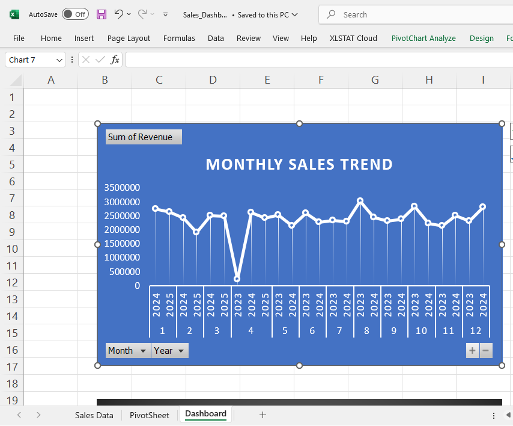
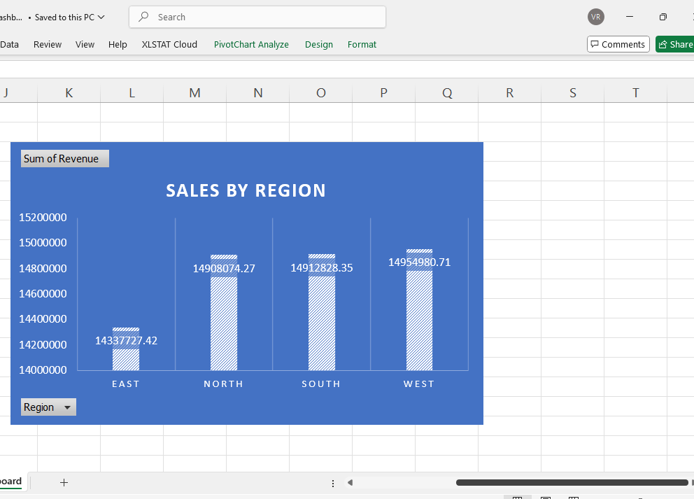
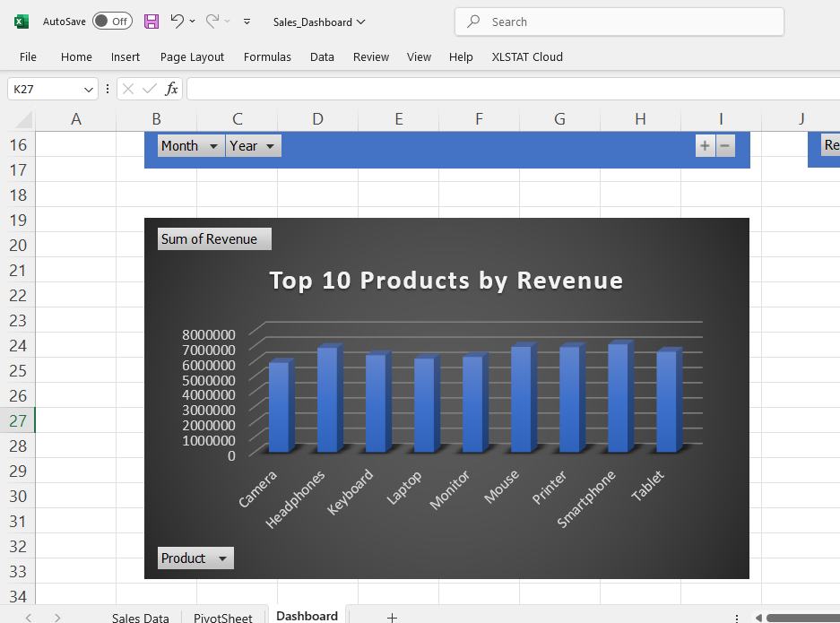
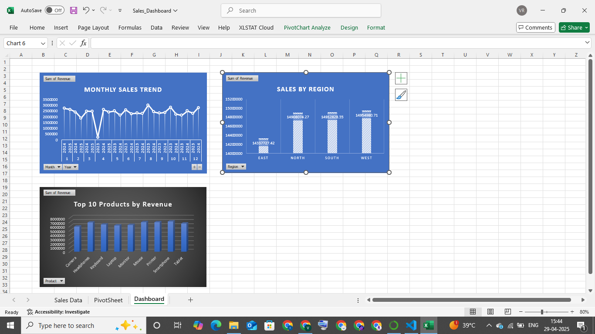

# 📊 Sales Data Analysis Project (Excel + Python)

This project analyzes retail sales data to generate insights, trends, and dynamic reports using Python, Excel, and data visualization libraries.


---

## 🎯 Project Goals

- Clean and analyze sales data to identify key business insights.
- Create automated monthly/quarterly reports in CSV and PDF.
- Build a user-friendly Excel dashboard for decision-making support.

---

## 🧰 Tools & Technologies

- **Python Libraries**: `pandas`, `matplotlib`, `seaborn`, `xlsxwriter`, `reportlab`
- **Excel**: Pivot tables, slicers, conditional formatting
- **Jupyter Notebooks**
- **Visualization**: Seaborn & Matplotlib
- **Reporting**: PDF and CSV generation

---

## 🧪 Features & KPIs

- Top products by revenue
- Sales by region/store
- Monthly sales trends
- Customer retention insights
- Key Metrics: Total Revenue, Units Sold, Avg. Order Value

---

## 🚀 How to Run

1. Clone this repository:
   ```bash
   git clone https://github.com/vemularajesh225/sales-data-analysis.git
   cd sales-data-analysis


## 📊 Sample Visualizations

### 📈 Monthly Sales Trend


### 🗺️ Sales by Region


### 🏆 Top 10 Products by Revenue


### 📋 Excel Sales Dashboard

